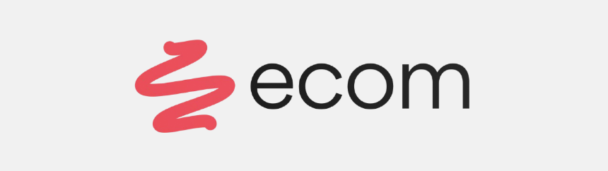

<p align="center">
  <a href="https://ecom-skheni.vercel.app/" target="_blank">
    
  </a><br/>
  <br />
  <a href="https://ecom-skheni.vercel.app/" target="_blank">
    
  </a>
</p>

## Table of Contents

* [Overview](#overview)
* [Why ECOM?](#why-ecom)
* [Built With](#built-with)
* [Getting Started](#getting-started)
  * [Prerequisites](#prerequisites)
  * [Environment Setup](#environment-setup)
  * [Installation](#installation)
  * [Usage](#usage)
* [License](#license)
* [Contributing](#contributing)
* [Star Us!](#star-us)


## Overview

**ECOM** is a full-featured open-source e-commerce platform built with **Next.js**, **Prisma**, and **Tailwind CSS**. It provides everything needed to launch a production-ready commerce app including authentication, product management, cart, wishlist, payments, real-time chat, dashboards, and profile management.


## Why ECOM?

* **Modular Architecture** – Clean and scalable structure using Next.js and Prisma.
* **Rich UI/UX** – Dynamic layouts, responsive components, and smooth animations.
* **API-Driven** – Backend for authentication, orders, products, users, and payments.
* **Fully Integrated** – Razorpay (payments), Cloudinary (media), Resend (email), and more.
* **Real-Time Features** – Chat, notifications, and role-based access control.

## Built With

|                                                                                               Tech                                                                                            |                                                                                                |
| ----------------------------------------------------------------------------------------------- | ---------------------------------------------------------------------------------------------- |
|                              |              |
|  |                |
|   |                       |
|         |  |
|  |      |
|               |                 |
|        | JSON, Markdown                                                                                 |


## Getting Started

> ### Prerequisites

Make sure you have the following installed:

* [Node.js](https://nodejs.org/) (v18+)
* [npm](https://www.npmjs.com/)

> ### Environment Setup

Create a `.env` file in the root directory and add the following:

```env
DATABASE_URL=
NEXTAUTH_SECRET=
NEXT_PUBLIC_CLOUDINARY_API_KEY=
RAZORPAY_KEY_ID=
RAZORPAY_KEY_SECRET=
RESEND_API_KEY=
```


> ### Installation

```bash
git clone https://github.com/therealdope/ecom
cd ecom
npm install
```


> ### Usage

Start the development server:

```bash
npm run dev
```

Visit `http://localhost:3000` in your browser.


## License

This project is licensed under the [MIT License](./LICENSE).


## Contributing

Contributions are welcome! Feel free to open issues, submit pull requests, or suggest features.


## Star Us!

If you find this project useful, consider giving it a ⭐ on [GitHub](https://github.com/therealdope/ecom)!
